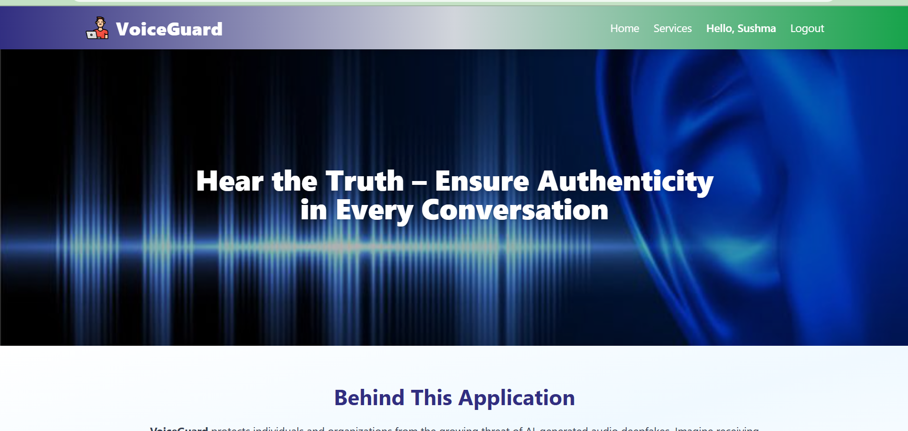
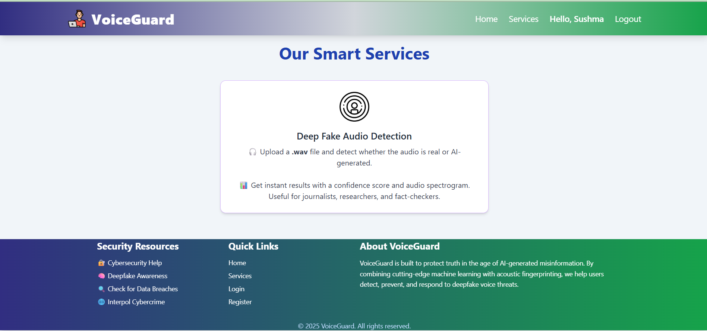
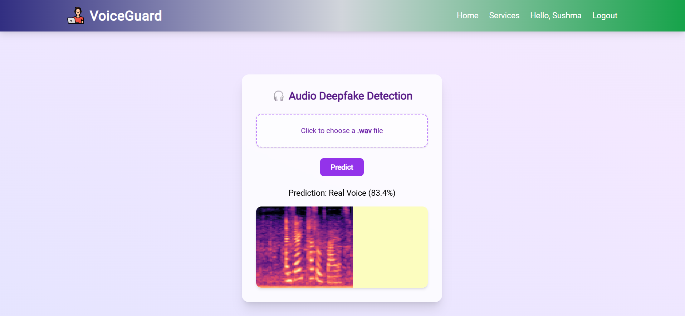

# 🧠 Audio Deepfake Detection Using CNN and Spectrograms

Detect whether an audio file is real or AI-generated using deep learning and mel spectrogram analysis.

   

---

## 📌 Table of Contents

- [🚀 Project Overview](#-project-overview)
- [🎯 Features](#-features)
- [🖼️ Screenshots](#-screenshots)
- [🧠 Tech Stack](#-tech-stack)
- [📊 Model Details](#-model-details)
- [📁 Dataset](#-dataset)
- [💡 How It Works](#-how-it-works)
- [💻 Running the Project](#-running-the-project)
- [📈 Results](#-results)
- [🛡️ Future Improvements](#-future-improvements)
- [🤝 Contributors](#-contributors)
- [🔗 Demo](#-demo)

---

## 🚀 Project Overview

With the rise of AI-generated content, voice deepfakes are being misused in scams and misinformation. This project uses a Convolutional Neural Network (CNN) trained on **mel spectrogram images** to classify whether an audio clip is **real** or **AI-generated**.

This project includes:
- A **deep learning model** trained on the [ASVspoof 2019 dataset](https://datashare.ed.ac.uk/handle/10283/3336)
- A fully functional **web application** using Flask
- Audio upload with real-time prediction
- Visualization of mel spectrogram and classification result

---

## 🎯 Features

✅ Real vs. Fake audio classification  
✅ Mel spectrogram conversion using Librosa  
✅ 4-layer CNN trained on spectrogram images  
✅ Web UI with audio upload and prediction  
✅ Login-based access control  
✅ Admin dashboard to view registered users  
✅ 99% accuracy on validation data  

---

## 🖼️ Screenshots
| Home Page |
|-------------|
||
|-------------------------|
| Upload Page | Prediction Result |
|-------------|-------------------|
|  |  |

---

## 🧠 Tech Stack

**Frontend**  
- HTML, CSS, JavaScript

**Backend**  
- Python, Flask, Jinja2

**Deep Learning**  
- TensorFlow / Keras  
- Librosa (for spectrogram conversion)  
- Numpy, OpenCV, Matplotlib

**Model**  
- CNN with ReLU, Softmax, MaxPooling, Dropout

**Deployment**  
- Flask Web App  
- Serialized model using Pickle (`model.pkl`)

---

## 📊 Model Details

- **Input:** 128×128 mel spectrogram images
- **CNN Architecture:**
  - Conv2D → ReLU → MaxPooling
  - Dropout for regularization
  - Dense → Softmax (2 output classes)
- **Optimizer:** Adam  
- **Loss Function:** Categorical Crossentropy  
- **Training Accuracy:** 99%  
- **Validation Accuracy:** 98.7%

---

## 📁 Dataset

- **Name:** ASVspoof 2019 Dataset  
- **Source:** [Official ASVspoof Dataset](https://datashare.ed.ac.uk/handle/10283/3336)  
- **Files:** `.wav` audio files  
- **Preprocessing:** Converted to mel spectrograms using Librosa  
- **Total Files:**  
  - Training: 10,642  
  - Testing: 2,542

---

## 💡 How It Works

1. **Upload** `.wav` audio through the web interface
2. **Convert** to mel spectrogram using `librosa.feature.melspectrogram()`
3. **Feed** the spectrogram into the CNN model
4. **Predict** whether the audio is real or AI-generated
5. **Display** result with confidence and spectrogram image

---

## 💻 Running the Project

### ⚙️ Prerequisites

```bash
pip install -r requirements.txt

---

## 🔗 Demo

🚀 [Click here for Live Demo]()  


